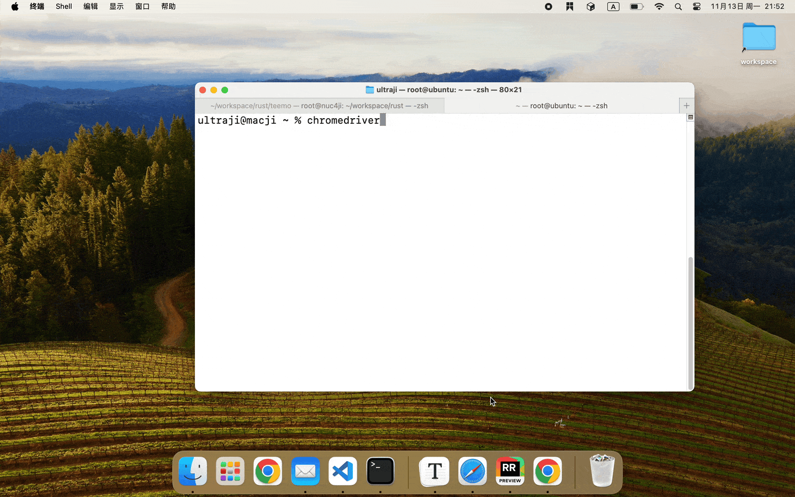

# teemo

A simple to use and efficient Web Automation Tool.



**teemo** allows you to do some web automation action(such as click and so on) and crawl some information from web. You can define your steps as follows:

```yaml
steps:
- action: Goto
  url: https://google.com
- action: Click
  locator: {strategy: XPath, expr: '//*[@id="L2AGLb"]'}
  alowSkip: true
- action: Wait
  timeout: 5
- action: SendKeys
  value: [ 'ultraji', 'Key::Enter']
  locator: { strategy: XPath, expr: '//*[@id="APjFqb"]' }
- action: Wait
  timeout: 5
- action: GetElemText
  locator: { strategy: XPath, expr: '//*[@id="rso"]/div[1]/div/div/div[1]/div/div/span/a/div/div/div/cite' }
  resourceName: first_item
- action: Wait
  timeout: 5
content: "This is first item of searching ultraji. It's ${first_item}. "
```

then it will run automatically. And finally it will return as follows:

```text
This is first item of searching ultraji. It's https://github.com › ultraji. 
```

# usage
teemo uses [webdriver](https://www.selenium.dev/documentation/webdriver/) under the hood. So please make sure that webdriver has been installed. (For example, if you are using chrome, you can download **the same version** [chrome-webdriver](https://chromedriver.chromium.org/) as your browser.)

You can use the following command:

```shell
chromedriver &
teemo -c teemo.yaml
```

# more info
More webdriver capabilities will be developed as soon.

```shell
teemo --help
```
